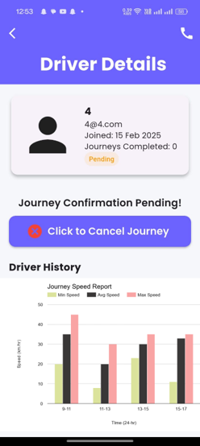

# Heavy Driver Tracker

## Description
A Flutter-based application for tracking driving hours, real-time alerts, accident detection, and health recommendations for professional drivers.

## Features
* Real-time location tracking with Google Maps integration
* Firebase authentication and Firestore database for secure data storage
* Push notifications for alerts and emergency situations
* Accident detection using device accelerometer/gyroscope data
* Health recommendations based on driving behavior and patterns
* Driver fatigue monitoring and break reminders

## Screenshots

<table>
  <tr>
    <td></td>
    <td></td>
  </tr>
  <tr>
    <td></td>
    <td></td>
  </tr>
</table>

## Installation

### Prerequisites
* Flutter SDK (2.0.0 or later)
* Dart SDK (2.12.0 or later)
* Android Studio / Xcode
* Firebase account
* Google Maps API key

### Step 1: Clone the Repository
```sh
git clone https://github.com/atuldeswal/Heavy-Driver-Tracker.git
cd Heavy-Driver-Tracker
```

### Step 2: Setup Google Maps API Key
* Open the **android/local.properties** file and add your **Google Maps API Key**:
```properties
googleMapsApiKey=YOUR_GOOGLE_MAPS_API_KEY
```

### Step 3: Setup Firebase
1. **Create a Firebase project** and enable Firebase services
2. **Download** `google-services.json` (for Android) and `GoogleService-Info.plist` (for iOS)
3. **Enable Firebase Authentication and Firestore Database** in your Firebase Console
4. **Add Firebase config files**:
   * **For Android**: Place `google-services.json` inside `android/app/`
   * **For iOS**: Place `GoogleService-Info.plist` inside `ios/Runner/`

### Step 4: Configure API Keys
* When you link your Firebase project, Firebase will generate the necessary configuration files. You need to place these files in the appropriate folders as mentioned above, not create them manually.

* Create a folder named `static/` in the project root:
```sh
mkdir static
```

* Create a file `api_keys.dart` inside `static/` to store your **Google API Key**:
```dart
// static/api_keys.dart
const String googleMapsApiKey = "YOUR_GOOGLE_MAPS_API_KEY";
```

### Step 5: Install Dependencies
```sh
flutter pub get
```

### Step 6: Run the App
```sh
flutter run
```

## 📂 Project Structure
```
lib/
│── authentication/
│   │── add_driver_page.dart
│   │── login_page.dart
│   │── signup_page.dart
│
│── static/
│   │── api_keys.dart
│
│── views/
│   │── main.dart
│   │── notification_history_page.dart
```

## Contributing
Contributions are welcome! Please feel free to submit a Pull Request.

## Contact
- GitHub: [@atuldeswal](https://github.com/atuldeswal)
- For any questions or suggestions, please reach out to [hunnydeswal2@gmail.com](mailto:hunnydeswal2@gmail.com)
